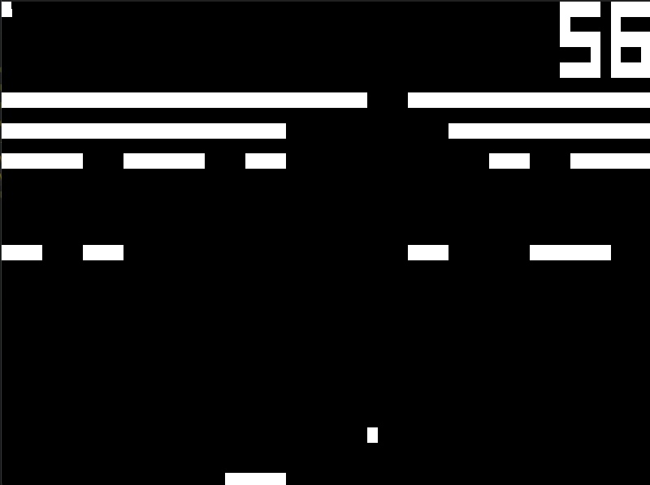

# Chip8 Emulator 
This is an emulator for the Chip8 CPU. At the moment, it handles 
graphics with my custom graphics library that is not yet published, so the code 
may be more useful as a reference or guide. 

## Features 
This emulator passes all test suites. To retest, run the `c8_test.c8` rom in the 
project root. 

Additionally, this project comes with a full assembler, so that the programmer 
does not have to write Chip8 instructions in binary. The syntax is similar to that 
of Intel x86 assembly, and a simple guide is found in the `assembler.rs` file. 
This assembler also accepts labels, which are typed simply as `.labelName`. 
Jumping to a label is equally straightforward, and can be done with the `jp .labelName` 
command. 

## Screenshots

